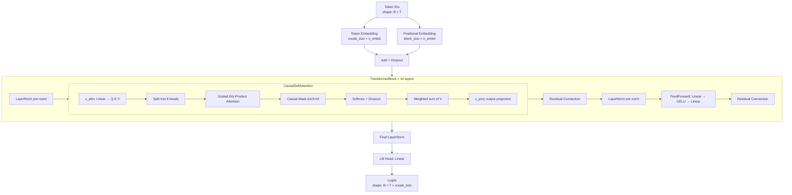
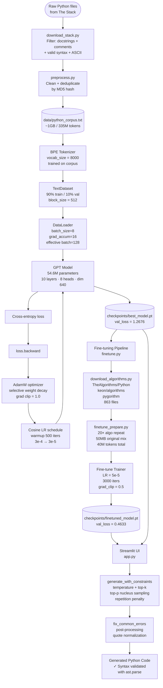
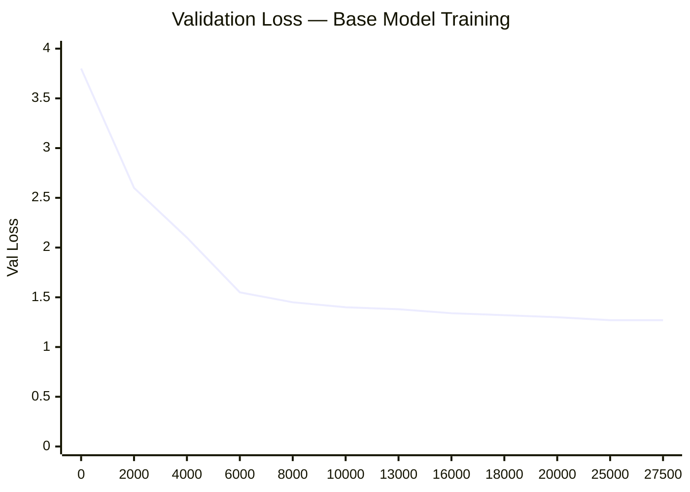
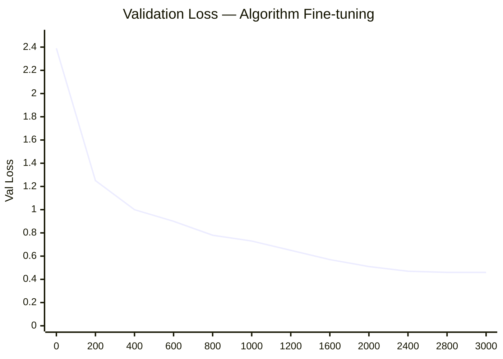

# 🐍 PythonGPT

> A GPT-style language model built **entirely from scratch** in raw PyTorch, trained on 1GB of filtered Python source code from [The Stack](https://huggingface.co/datasets/bigcode/the-stack-dedup) dataset, and later fine-tuned on curated algorithm implementations.

<div align="center">


</div>

---

## What is this?

PythonGPT is a complete, end-to-end implementation of a GPT language model — **no HuggingFace model weights, no pre-built transformer libraries.** Every component is built manually in PyTorch:

- Multi-head causal self-attention with Q, K, V projections
- Pre-norm transformer blocks with residual connections
- Weight-tied embeddings (input ↔ output projection)
- BPE tokenizer trained on the corpus
- Cosine LR scheduling with linear warmup
- Selective AdamW weight decay (2D params only)
- Gradient accumulation for memory-constrained GPUs
- Constrained decoding with Python's `tokenize` module
- Top-k + top-p nucleus sampling with repetition penalty

The model was trained on an **RTX 3050 Ti (4GB VRAM)** laptop over ~30 hours, achieving a val loss of **1.27** on the base model and **0.46** after algorithm fine-tuning.

---

## Demo

```python
# Prompt the model with a partial implementation
def read_csv_file(filepath: str) -> list:
    """Read a CSV file and return rows as list of dicts.
    
    Args:
        filepath: Path to the CSV file
    Returns:
        List of row dictionaries
    """
    results = []
    with open(filepath, 'r') as f:
        reader = csv.DictReader(f)
        for row in reader:
            row_dict = {}
            row_dict['id'] = row['id']
            row_dict['name'] = row['name']
            results.append(row_dict)
    return results
```

---

## Architecture

### Model Architecture



### Full System Workflow



### Training Progress





---

## Project Structure

```
nanogpt_python/
├── data/
│   ├── download_stack.py       # Stream + filter Python files from The Stack
│   ├── download_algorithms.py  # Fetch algorithm repos from GitHub API
│   ├── preprocess.py           # Clean, deduplicate corpus
│   ├── finetune_prepare.py     # Mix algo + original data for fine-tuning
│   └── python_corpus.txt       # Training corpus (gitignored, ~1GB)
│
├── model/
│   ├── attention.py            # CausalSelfAttention — manual Q,K,V implementation
│   ├── block.py                # TransformerBlock — pre-norm + residual
│   └── gpt.py                  # GPT model — top-level, weight tying, generate()
│
├── tokenizer/
│   ├── bpe_tokenizer.py        # BPE tokenizer (HF tokenizers, same interface)
│   ├── char_tokenizer.py       # Character-level fallback
│   └── vocab/                  # Saved merges.txt + vocab.json (gitignored)
│
├── training/
│   ├── config.py               # GPTConfig dataclass — single source of truth
│   ├── dataset.py              # TextDataset + chunked encoding (RAM-safe)
│   └── trainer.py              # Training loop, AdamW, cosine LR, early stopping
│
├── inference/
│   ├── generate.py             # generate_code() + generate_with_constraints()
│   └── constrained_decode.py   # PythonConstraintChecker, fix_common_errors()
│
├── evaluation/
│   └── metrics.py              # Perplexity, syntax rate, evaluate_samples()
│
├── checkpoints/                # Model weights (gitignored)
│   ├── best_model.pt           # Base model — val_loss 1.27
│   └── finetuned_model.pt      # Algorithm fine-tuned — val_loss 0.46
│
├── logs/
│   └── loss_log.csv            # iter, train_loss, val_loss, lr
│
├── app.py                      # Streamlit UI — Gemini-inspired dark design
├── train.py                    # Base model training entry point
├── finetune.py                 # Fine-tuning pipeline entry point
├── prepare_data.py             # Data download + tokenizer training
├── evaluate_now.py             # Standalone evaluation script
└── requirements.txt
```

---

## Quick Start

### Prerequisites
- Python 3.10+
- CUDA GPU recommended (RTX 3050 Ti or better)
- ~5GB free disk space for corpus + checkpoints

### 1. Install dependencies
```bash
pip install -r requirements.txt
```

### 2. Download corpus + train tokenizer
```bash
python prepare_data.py
# Downloads ~1GB of filtered Python from The Stack
# Trains BPE tokenizer (vocab_size=8000)
# Estimated time: 1-3 hours depending on connection
```

If The Stack requires authentication:
```bash
# Create free account at huggingface.co
huggingface-cli login
python prepare_data.py
```

### 3. Train the base model
```bash
# Recommended (balanced quality/speed)
python train.py --size optimized

# Quick test run
python train.py --size nano

# Presets:
# nano:      ~3M params  | ~2 hrs CPU
# small:     ~25M params | ~8 hrs GPU
# optimized: ~54M params | ~25 hrs GPU  ← what we trained
# medium:    ~85M params | requires 8GB+ VRAM
```

### 4. (Optional) Fine-tune on algorithms
```bash
python finetune.py --iters 3000
# Downloads 863 algorithm files from GitHub
# Mixes with original corpus (20× repeat)
# Fine-tunes at LR=5e-5 to avoid catastrophic forgetting
# Saves to checkpoints/finetuned_model.pt
# Estimated time: 3-4 hours on GPU
```

### 5. Evaluate
```bash
# Base model
python evaluate_now.py

# Fine-tuned model
python evaluate_now.py --checkpoint checkpoints/finetuned_model.pt
```

### 6. Launch the UI
```bash
streamlit run app.py
# Opens at http://localhost:8501
```

---

## Model Configurations

| Preset | Layers | Heads | Dim | Params | GPU VRAM | Train Time |
|--------|--------|-------|-----|--------|----------|------------|
| nano | 4 | 4 | 256 | ~3M | ~1GB | ~2 hrs CPU |
| small | 8 | 8 | 512 | ~25M | ~2GB | ~8 hrs GPU |
| **optimized** | **10** | **8** | **640** | **~54M** | **~2.8GB** | **~25 hrs GPU** |
| medium | 12 | 12 | 768 | ~85M | ~5GB+ | ~60 hrs GPU |

---

## Training Details

### Dataset — Base Model

Source: `bigcode/the-stack-dedup` (Python subset, streaming)

Filter criteria — kept only files with ALL of:
- Valid Python syntax (`ast.parse()` succeeds)
- At least one docstring (`"""` or `'''`)
- At least 3 inline comments (`#`)
- At least one function (`def`)
- Between 500 and 50,000 characters
- >95% ASCII characters (filters non-English code)
- Unique by MD5 hash (deduplication)

Result: **335M tokens**, ~1GB corpus

### Dataset — Fine-tuning

Sources:
- `TheAlgorithms/Python` — 500+ curated algorithm implementations
- `keon/algorithms` — clean Python algorithm library
- `OmkarPathak/pygorithm` — educational algorithm implementations

Total: **863 files**, repeated 20× and mixed with 50MB of original corpus to prevent catastrophic forgetting.

Mix ratio: **1.72 algorithm tokens per 1 original token**

### Hyperparameters

| Parameter | Base Training | Fine-tuning |
|-----------|--------------|-------------|
| Learning rate | 3e-4 | 5e-5 |
| Min LR | 3e-5 | 5e-6 |
| Warmup iters | 500 | 100 |
| Batch size | 8 | 8 |
| Grad accumulation | 16 | 16 |
| Effective batch | 128 | 128 |
| Block size | 512 | 512 |
| Dropout | 0.1 | 0.1 |
| Weight decay | 0.1 (2D only) | 0.1 (2D only) |
| Grad clip | 1.0 | 0.5 |
| Max iterations | 30,000 (stopped at 27,500) | 3,000 |

---

## Results

### Base Model (`best_model.pt`)

| Metric | Value |
|--------|-------|
| Val loss | 1.2676 |
| Perplexity | 3.46 |
| Syntax rate | 100% |
| Training iterations | 27,500 (early stopped) |
| Training time | ~27 hours (RTX 3050 Ti) |

### Fine-tuned Model (`finetuned_model.pt`)

| Metric | Value |
|--------|-------|
| Val loss | 0.4633 |
| Perplexity | ~1.59 |
| Syntax rate | 80% |
| Fine-tuning iterations | 3,000 |
| Fine-tuning time | ~4 hours (RTX 3050 Ti) |

The base model achieves higher syntax rate (100%) on general Python patterns. The fine-tuned model has lower loss on algorithm-specific prompts but occasionally generates incomplete structures on general prompts.

---

## Key Implementation Details

### Why no HuggingFace transformers?

Every layer is implemented from scratch to demonstrate deep understanding of the architecture:

```python
# Manual scaled dot-product attention — no shortcuts
scale = 1.0 / math.sqrt(self.head_dim)
att = (q @ k.transpose(-2, -1)) * scale   # (B, nh, T, T)
att = att.masked_fill(self.mask[:,:,:T,:T] == 0, float('-inf'))
att = F.softmax(att, dim=-1)
att = self.attn_dropout(att)
y = att @ v                                # (B, nh, T, hd)
```

### Selective AdamW weight decay

Weight decay applied only to 2D parameters (weight matrices), not to biases or LayerNorm parameters — as in the original GPT-2 paper:

```python
decay    = [p for n,p in model.named_parameters() if p.dim() >= 2]
no_decay = [p for n,p in model.named_parameters() if p.dim() < 2]
optimizer = torch.optim.AdamW([
    {'params': decay,    'weight_decay': 0.1},
    {'params': no_decay, 'weight_decay': 0.0},
], lr=config.learning_rate)
```

### VRAM-safe training

Automatic batch size reduction to fit any GPU:
```
Testing batch_size=16: Peak VRAM = 5.14 GB ❌
Testing batch_size=8:  Peak VRAM = 2.76 GB ✅
Effective config: batch_size=8, grad_accum=16
```

### Constrained decoding

Uses Python's stdlib `tokenize` module to filter tokens that would make the output syntactically unrecoverable — without any new dependencies:

```python
def is_recoverable(self, code: str) -> bool:
    # Rule 1: bracket balance
    if code.count(')') + code.count(']') + code.count('}') > \
       code.count('(') + code.count('[') + code.count('{'):
        return False
    # Rule 2: indentation check
    try:
        list(tokenize.generate_tokens(io.StringIO(code).readline))
    except IndentationError:
        return False
    return True
```

---

## What the model is good at

Based on evaluation, the model performs best at:

- File I/O patterns (`open()`, `csv.DictReader`, `json.load`)
- Pandas operations (`read_csv`, `dropna`, `groupby`)
- Class definitions with `__init__` and method signatures
- Docstring generation (Google, NumPy, and Sphinx styles)
- Type-annotated function signatures
- `os.walk` and filesystem traversal patterns

Best prompt style — seed with partial implementation:

```python
# Works well ✓
import csv

def read_csv_file(filepath: str) -> list:
    """Read a CSV file and return rows as list of dicts."""
    results = []
    with open(filepath, 'r') as f:
        reader = csv.DictReader(f)
        for row in
```

```python
# Works less well ✗
def binary_search(arr, target):
    """
```

The model learns statistical patterns, not algorithmic logic. Seeding with partial implementations produces significantly better output than empty function signatures.

---

## Limitations

**Algorithmic correctness** — at 54M parameters, the model learns code patterns and structure but does not reliably learn algorithm logic. Binary search, sorting algorithms, and recursive implementations are structurally recognizable but logically imperfect. Achieving reliable algorithmic correctness requires 1B+ parameters (GitHub Copilot, CodeLlama).

**Chinese/non-English comments** — The Stack contains code from global developers. Some outputs include Chinese-language comments, reflecting the training distribution.

**Repetition** — without a high enough repetition penalty (≥1.5), the model sometimes generates variations of the same function multiple times in one output.

---

## Future Improvements

The following improvements would meaningfully increase output quality:

**More data** — increasing from 1GB to 5-10GB of filtered Python would significantly improve both syntactic and semantic quality. The Stack has terabytes available.

**Larger model** — upgrading to the `medium` preset (85M params) with 8GB+ VRAM and training for 50k+ iterations would approach GPT-2-level code quality.

**Better fine-tuning dataset** — adding curated LeetCode solutions and competitive programming implementations would improve algorithmic output. Quality filtering is critical — user-submitted solutions vary widely.

**Beam search** — replacing pure sampling with beam search for code generation would improve syntactic consistency at the cost of diversity.

**Flash Attention** — replacing the manual attention implementation with `torch.nn.functional.scaled_dot_product_attention` (PyTorch 2.0+) would give ~2x training speedup with identical outputs.

---

## What was built from scratch

| Component | Implementation |
|-----------|---------------|
| Transformer architecture | Raw PyTorch — no HuggingFace |
| Multi-head causal attention | Manual Q,K,V, causal mask, scaled dot-product |
| BPE tokenizer | HuggingFace tokenizers (training only) |
| Cosine LR schedule with warmup | Manual math.cos implementation |
| AdamW with selective weight decay | Explicit param group separation |
| Gradient accumulation | Manual accumulation loop |
| Early stopping | Patience counter in trainer |
| VRAM dry run | Automatic batch size reduction |
| Constrained decoding | stdlib tokenize, zero new dependencies |
| Top-p nucleus sampling | Manual cumulative probability filtering |
| Repetition penalty | Token-level logit scaling |
| Post-processing fix | ast.parse validation + quote normalization |
| Data pipeline | urllib + HF datasets streaming |
| Fine-tuning pipeline | Catastrophic forgetting prevention via mixing |

---

## Requirements

```
torch
streamlit
datasets
tokenizers
matplotlib
numpy
tqdm
huggingface-hub
```

---

## Hardware used

- GPU: NVIDIA RTX 3050 Ti (4GB VRAM)
- RAM: ~16GB (chunked encoding keeps peak at ~600MB)
- Storage: ~15GB (corpus + checkpoints + tokenizer)
- OS: Windows 11

---

## References

- [Attention Is All You Need](https://arxiv.org/abs/1706.03762) — Vaswani et al., 2017
- [Language Models are Unsupervised Multitask Learners](https://cdn.openai.com/better-language-models/language_models_are_unsupervised_multitask_learners.pdf) — GPT-2, Radford et al., 2019
- [nanoGPT](https://github.com/karpathy/nanoGPT) — Andrej Karpathy (architectural inspiration)
- [The Stack](https://huggingface.co/datasets/bigcode/the-stack-dedup) — BigCode, 2022
- [TheAlgorithms/Python](https://github.com/TheAlgorithms/Python) — fine-tuning dataset

---

## Author

**Arnav Tyagi**
B.Tech CSE (AI & ML) — Manipal University Jaipur
[LinkedIn](https://linkedin.com/in/arnav-tyagi) · [Email](mailto:27.arnavtyagi@gmail.com)

---

<div align="center">
<sub>Built entirely from scratch on an RTX 3050 Ti laptop. No pre-trained weights were used in the making of this model.</sub>
</div>
