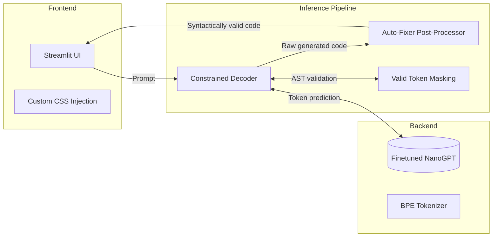

# PythonGPT: NanoGPT Trained from Scratch

A sleek, premium Streamlit application wrapping a custom NanoGPT model trained from scratch on 1GB of Python source code. The pipeline features a highly-optimized minimalist UI, intelligent constrained decoding to enforce syntactically valid code generation, and an automatic post-processing syntax auto-fixer. 

The model has also been actively **fine-tuned** to improve structural output and completion rates!

## Screenshots

*(Add screenshots of your UI here)*
> Tip: Showcase the deep dark radial gradient background, the floating metric badges, and the minimalist quick snippet buttons!

## What it does

1. **Custom Model** — A custom NanoGPT architecture trained on 1GB of raw Python code, and further fine-tuned for high-quality generation.
2. **Constrained Decoding** — Employs a custom decoding strategy that filters out syntactically invalid tokens during generation using Python's native `ast` parser.
3. **Auto-Fixer** — A post-generation pipeline that intelligently patches truncated or broken code (e.g., missing pass statements, unclosed docstrings).
4. **Minimalist UI** — A heavily customized Streamlit interface built with pure CSS and HTML injection, bypassing Streamlit's default components to achieve a premium dark aesthetic.
5. **Real-time Metrics** — Displays dynamic, inline pill badges that show syntax validity, completion status, and generation time directly inside the chat interface.

## Architecture



## Tech Stack

* **Python 3.10+**
* **PyTorch** (Model training, fine-tuning, and inference)
* **Streamlit** (Frontend framework)
* **HTML/CSS** (Custom UI styling & layout hacking)
* **Python AST** (Abstract Syntax Tree parsing for generation constraints)

## Prerequisites

* Python 3.10 or newer
* PyTorch (CUDA supported recommended for fast inference)
* Streamlit

## Setup

```bash
git clone https://github.com/your-username/PythonGPT.git
cd PythonGPT

python -m venv .venv
# Windows
.venv\Scripts\activate
# macOS / Linux
source .venv/bin/activate

pip install -r requirements.txt
```

## Run

```bash
streamlit run app.py
```

Open `http://localhost:8501`, enter a Python prompt, or click one of the **Quick Topics** to auto-fill the chat box!

## Configuration

You can tweak the engine's generation hyperparameters dynamically in the UI under the **Status ▾** dropdown:

| Parameter | Default | Purpose |
| :--- | :--- | :--- |
| **Temperature** | `0.2` | Controls creativity. Kept low to enforce strict code formatting and prevent hallucinated syntax. |
| **Repetition Penalty** | `1.05` | Prevents the model from getting stuck in loops while allowing natural code repetition (like `self.`). |
| **Top-k & Top-p** | `40` / `0.95` | Constrains the token sampling pool to high-probability tokens. |
| **Max Tokens** | `500` | Caps the length of the generation before artificial truncation. |
| **Constrained Decoding**| `False` | Toggle the AST token-masking pipeline on or off during inference. |

## Project layout

```text
PythonGPT/
├── app.py                     # Streamlit frontend & Custom CSS injection
├── train.py                   # NanoGPT training script
├── finetune.py                # Fine-tuning script
├── inference/
│   └── constrained_decode.py  # Inference logic, constraint masking, & Auto-fixer
├── checkpoints/
│   ├── best_model.pt          # Base model checkpoint
│   └── finetuned_model.pt     # Fine-tuned default checkpoint
└── README.md                  # This file
```
